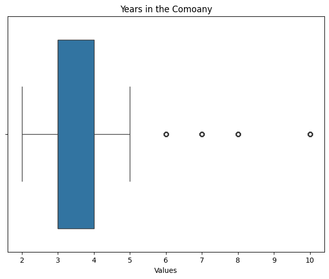
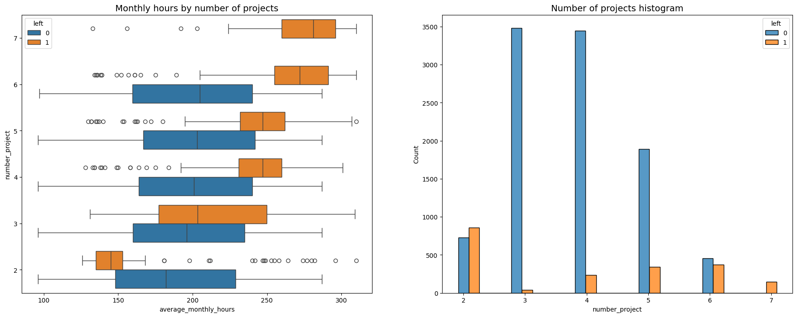

# **Machine Learning project: Providing a churn model and insights to HR**

## Description 

This capstone project is an opportunity for me to analyze a dataset and build predictive models that can provide insights to the Human Resources (HR) department of a large consulting firm.

As part of my deliverables, I will include the model evaluation and interpretation, data visualizations of that will provide insights and answers to the questions stakeholders ask, ethical considerations, and the resources I used to troubleshoot and find answers or solutions.


### Understanding the business scenario and problem 

The HR department at Salifort Motors wants to take some initiatives to improve employee satisfaction levels at the company. They collected data from employees, but now they don’t know what to do with it. They request my supprt as a data analytics professional and ask me to provide data-driven suggestions based on my understanding of the data. They have the following question: what’s likely to make the employee leave the company?

My goals in this project are to analyze the data collected by the HR department and to build a model that predicts whether or not an employee will leave the company.

If we can predict employees likely to quit, it might be possible to identify factors that contribute to their leaving. Because it is time-consuming and expensive to find, interview, and hire new employees, increasing employee retention will be beneficial to the company.

### Dataset dictionary

The dataset that I'll be using in this lab contains 15,000 rows and 10 columns for the variables listed below. 

**Note:** For more information about the data, refer to its source on [Kaggle](https://www.kaggle.com/datasets/mfaisalqureshi/hr-analytics-and-job-prediction?select=HR_comma_sep.csv).

Variable  |Description |
-----|-----|
satisfaction_level|Employee-reported job satisfaction level [0–1]|
last_evaluation|Score of employee's last performance review [0–1]|
number_project|Number of projects employee contributes to|
average_monthly_hours|Average number of hours employee worked per month|
time_spend_company|How long the employee has been with the company (years)
Work_accident|Whether or not the employee experienced an accident while at work
left|Whether or not the employee left the company
promotion_last_5years|Whether or not the employee was promoted in the last 5 years
Department|The employee's department
salary|The employee's salary (U.S. dollars)

💭
### Reflect on these questions as you complete the plan stage.

- Who are your stakeholders for this project?
  
  **Answer**: The main stakeholders in this project include the HR department at Salifort Motors, Data Analytics managers responsible for engaging stakeholders and validating insights, and potentially, any Program/Project manager who will utilize the findings to propose potential solutions.

- What are you trying to solve or accomplish?

  **Answer**: The intent is to leverage machine learning models to analyze and identify employees who are more likely to leave the company. This will empower the Salifort HR team to understand the major factors influencing churn and provide potential hypotheses for solutions. This approach also offers cost and time advantages compared to other analytical methods, such as surveys and interviews.
  
- What resources do you find yourself using as you complete this stage?

  **Answer**: The resources that will be used in this project include Jupyter Notebook for documentation and data manipulations, the Pandas library for data manipulation, Matplotlib and Seaborn libraries for visualization, the Scikit-learn library for predictive analysis, and a couple of machine learning models to evaluate data and provide predictions.
  
- Do you have any ethical considerations in this stage?

  **Answer**: When addressing the ethical considerations in our analysis, it's crucial to first ensure that the data we analyze is representative of the entire company. This is vital as predictions may exhibit issues with certain characteristics like gender or race, potentially introducing biases into the model. Therefore, being vigilant about potential biases is paramount.
  
    Another significant concern revolves around the model signaling certain employees as being "more at risk" of leaving. This could have a negative impact on their careers. Consequently, the company must carefully consider how to responsibly use these predictions, balancing the potential benefits with the ethical implications for individual employees.

    Furthermore, it's important to note that some machine learning models, especially those more complex, may be challenging to explain in terms of how they reach specific conclusions. This lack of transparency can hinder our ability to clearly communicate the results. Therefore, efforts should be made to enhance transparency, allowing for a better understanding of the model's decision-making process.


## Step 1. Importing packages

*   Importing packages
*   Loading dataset


### Import packages


```python
import numpy as np 
import pandas as pd
import matplotlib.pyplot as plt
import seaborn as sns
import pickle

from sklearn.model_selection import train_test_split
from sklearn.model_selection import train_test_split
from sklearn.model_selection import GridSearchCV
from sklearn.tree import DecisionTreeClassifier
from sklearn.ensemble import RandomForestClassifier
from sklearn.tree import plot_tree
import sklearn.metrics as metrics
from xgboost import XGBClassifier
from xgboost import plot_importance
from IPython.display import FileLink


from sklearn.metrics import accuracy_score, precision_score, recall_score,\
f1_score, confusion_matrix, ConfusionMatrixDisplay, classification_report
from sklearn.metrics import roc_auc_score, roc_curve
from sklearn.tree import plot_tree


```


```python
# Load dataset into a dataframe
data = pd.read_csv("HR_capstone_dataset.csv")


# Display first few rows of the dataframe

data.head()
```


<div>
<style scoped>
    .dataframe tbody tr th:only-of-type {
        vertical-align: middle;
    }

    .dataframe tbody tr th {
        vertical-align: top;
    }

    .dataframe thead th {
        text-align: right;
    }
</style>
<table border="1" class="dataframe">
  <thead>
    <tr style="text-align: right;">
      <th></th>
      <th>satisfaction_level</th>
      <th>last_evaluation</th>
      <th>number_project</th>
      <th>average_montly_hours</th>
      <th>time_spend_company</th>
      <th>Work_accident</th>
      <th>left</th>
      <th>promotion_last_5years</th>
      <th>Department</th>
      <th>salary</th>
    </tr>
  </thead>
  <tbody>
    <tr>
      <th>0</th>
      <td>0.38</td>
      <td>0.53</td>
      <td>2</td>
      <td>157</td>
      <td>3</td>
      <td>0</td>
      <td>1</td>
      <td>0</td>
      <td>sales</td>
      <td>low</td>
    </tr>
    <tr>
      <th>1</th>
      <td>0.80</td>
      <td>0.86</td>
      <td>5</td>
      <td>262</td>
      <td>6</td>
      <td>0</td>
      <td>1</td>
      <td>0</td>
      <td>sales</td>
      <td>medium</td>
    </tr>
    <tr>
      <th>2</th>
      <td>0.11</td>
      <td>0.88</td>
      <td>7</td>
      <td>272</td>
      <td>4</td>
      <td>0</td>
      <td>1</td>
      <td>0</td>
      <td>sales</td>
      <td>medium</td>
    </tr>
    <tr>
      <th>3</th>
      <td>0.72</td>
      <td>0.87</td>
      <td>5</td>
      <td>223</td>
      <td>5</td>
      <td>0</td>
      <td>1</td>
      <td>0</td>
      <td>sales</td>
      <td>low</td>
    </tr>
    <tr>
      <th>4</th>
      <td>0.37</td>
      <td>0.52</td>
      <td>2</td>
      <td>159</td>
      <td>3</td>
      <td>0</td>
      <td>1</td>
      <td>0</td>
      <td>sales</td>
      <td>low</td>
    </tr>
  </tbody>
</table>
</div>


## Step 2. Data Exploration (Initial EDA and data cleaning)

- Understanding the variables
- Cleaninh the dataset (missing data, redundant data, outliers)


### Gathering basic information about the data


```python
# Gather basic information about the data

data.info()
```

    <class 'pandas.core.frame.DataFrame'>
    RangeIndex: 14999 entries, 0 to 14998
    Data columns (total 10 columns):
     #   Column                 Non-Null Count  Dtype  
    ---  ------                 --------------  -----  
     0   satisfaction_level     14999 non-null  float64
     1   last_evaluation        14999 non-null  float64
     2   number_project         14999 non-null  int64  
     3   average_montly_hours   14999 non-null  int64  
     4   time_spend_company     14999 non-null  int64  
     5   Work_accident          14999 non-null  int64  
     6   left                   14999 non-null  int64  
     7   promotion_last_5years  14999 non-null  int64  
     8   Department             14999 non-null  object 
     9   salary                 14999 non-null  object 
    dtypes: float64(2), int64(6), object(2)
    memory usage: 1.1+ MB
    


```python
# Gather descriptive statistics about the data

data.describe()
```


<div>
<style scoped>
    .dataframe tbody tr th:only-of-type {
        vertical-align: middle;
    }

    .dataframe tbody tr th {
        vertical-align: top;
    }

    .dataframe thead th {
        text-align: right;
    }
</style>
<table border="1" class="dataframe">
  <thead>
    <tr style="text-align: right;">
      <th></th>
      <th>satisfaction_level</th>
      <th>last_evaluation</th>
      <th>number_project</th>
      <th>average_montly_hours</th>
      <th>time_spend_company</th>
      <th>Work_accident</th>
      <th>left</th>
      <th>promotion_last_5years</th>
    </tr>
  </thead>
  <tbody>
    <tr>
      <th>count</th>
      <td>14999.000000</td>
      <td>14999.000000</td>
      <td>14999.000000</td>
      <td>14999.000000</td>
      <td>14999.000000</td>
      <td>14999.000000</td>
      <td>14999.000000</td>
      <td>14999.000000</td>
    </tr>
    <tr>
      <th>mean</th>
      <td>0.612834</td>
      <td>0.716102</td>
      <td>3.803054</td>
      <td>201.050337</td>
      <td>3.498233</td>
      <td>0.144610</td>
      <td>0.238083</td>
      <td>0.021268</td>
    </tr>
    <tr>
      <th>std</th>
      <td>0.248631</td>
      <td>0.171169</td>
      <td>1.232592</td>
      <td>49.943099</td>
      <td>1.460136</td>
      <td>0.351719</td>
      <td>0.425924</td>
      <td>0.144281</td>
    </tr>
    <tr>
      <th>min</th>
      <td>0.090000</td>
      <td>0.360000</td>
      <td>2.000000</td>
      <td>96.000000</td>
      <td>2.000000</td>
      <td>0.000000</td>
      <td>0.000000</td>
      <td>0.000000</td>
    </tr>
    <tr>
      <th>25%</th>
      <td>0.440000</td>
      <td>0.560000</td>
      <td>3.000000</td>
      <td>156.000000</td>
      <td>3.000000</td>
      <td>0.000000</td>
      <td>0.000000</td>
      <td>0.000000</td>
    </tr>
    <tr>
      <th>50%</th>
      <td>0.640000</td>
      <td>0.720000</td>
      <td>4.000000</td>
      <td>200.000000</td>
      <td>3.000000</td>
      <td>0.000000</td>
      <td>0.000000</td>
      <td>0.000000</td>
    </tr>
    <tr>
      <th>75%</th>
      <td>0.820000</td>
      <td>0.870000</td>
      <td>5.000000</td>
      <td>245.000000</td>
      <td>4.000000</td>
      <td>0.000000</td>
      <td>0.000000</td>
      <td>0.000000</td>
    </tr>
    <tr>
      <th>max</th>
      <td>1.000000</td>
      <td>1.000000</td>
      <td>7.000000</td>
      <td>310.000000</td>
      <td>10.000000</td>
      <td>1.000000</td>
      <td>1.000000</td>
      <td>1.000000</td>
    </tr>
  </tbody>
</table>
</div>


### Renaming columns

As a data cleaning step, I will rename the columns to facilitate understanding. Standardize the column names so that they are all in `snake_case`, correct any column names that are misspelled, and make column names more concise as needed.


```python
# Display all column names

data.columns
```


    Index(['satisfaction_level', 'last_evaluation', 'number_project',
           'average_montly_hours', 'time_spend_company', 'Work_accident', 'left',
           'promotion_last_5years', 'Department', 'salary'],
          dtype='object')


```python
# Rename columns as needed

data.rename(columns={'Work_accident': 'work_accident',
                          'average_montly_hours': 'average_monthly_hours',
                          'time_spend_company': 'tenure',
                          'Department': 'department'}, inplace=True)

# Display all column names after the update

data.columns
```


    Index(['satisfaction_level', 'last_evaluation', 'number_project',
           'average_monthly_hours', 'tenure', 'work_accident', 'left',
           'promotion_last_5years', 'department', 'salary'],
          dtype='object')


### Checking missing values


```python
# Check for missing values

missing_values = data.isna().value_counts()  
print(missing_values)
```

    satisfaction_level  last_evaluation  number_project  average_monthly_hours  tenure  work_accident  left   promotion_last_5years  department  salary
    False               False            False           False                  False   False          False  False                  False       False     14999
    Name: count, dtype: int64
    

### Checking duplicates


```python
# Check for duplicates
duplicates = data.duplicated()
print(data[duplicates])
```

           satisfaction_level  last_evaluation  number_project  \
    396                  0.46             0.57               2   
    866                  0.41             0.46               2   
    1317                 0.37             0.51               2   
    1368                 0.41             0.52               2   
    1461                 0.42             0.53               2   
    ...                   ...              ...             ...   
    14994                0.40             0.57               2   
    14995                0.37             0.48               2   
    14996                0.37             0.53               2   
    14997                0.11             0.96               6   
    14998                0.37             0.52               2   
    
           average_monthly_hours  tenure  work_accident  left  \
    396                      139       3              0     1   
    866                      128       3              0     1   
    1317                     127       3              0     1   
    1368                     132       3              0     1   
    1461                     142       3              0     1   
    ...                      ...     ...            ...   ...   
    14994                    151       3              0     1   
    14995                    160       3              0     1   
    14996                    143       3              0     1   
    14997                    280       4              0     1   
    14998                    158       3              0     1   
    
           promotion_last_5years  department  salary  
    396                        0       sales     low  
    866                        0  accounting     low  
    1317                       0       sales  medium  
    1368                       0       RandD     low  
    1461                       0       sales     low  
    ...                      ...         ...     ...  
    14994                      0     support     low  
    14995                      0     support     low  
    14996                      0     support     low  
    14997                      0     support     low  
    14998                      0     support     low  
    
    [3008 rows x 10 columns]
    


```python
# Inspect some rows containing duplicates 

promotion_duplicates = data[duplicates]['promotion_last_5years']
print(promotion_duplicates)
```

    396      0
    866      0
    1317     0
    1368     0
    1461     0
            ..
    14994    0
    14995    0
    14996    0
    14997    0
    14998    0
    Name: promotion_last_5years, Length: 3008, dtype: int64
    


```python
# Drop duplicates and save resulting dataframe in a new variable 

clean_data = data.drop_duplicates()

# Display first few rows of new dataframe 

clean_data.head()
```


<div>
<style scoped>
    .dataframe tbody tr th:only-of-type {
        vertical-align: middle;
    }

    .dataframe tbody tr th {
        vertical-align: top;
    }

    .dataframe thead th {
        text-align: right;
    }
</style>
<table border="1" class="dataframe">
  <thead>
    <tr style="text-align: right;">
      <th></th>
      <th>satisfaction_level</th>
      <th>last_evaluation</th>
      <th>number_project</th>
      <th>average_monthly_hours</th>
      <th>tenure</th>
      <th>work_accident</th>
      <th>left</th>
      <th>promotion_last_5years</th>
      <th>department</th>
      <th>salary</th>
    </tr>
  </thead>
  <tbody>
    <tr>
      <th>0</th>
      <td>0.38</td>
      <td>0.53</td>
      <td>2</td>
      <td>157</td>
      <td>3</td>
      <td>0</td>
      <td>1</td>
      <td>0</td>
      <td>sales</td>
      <td>low</td>
    </tr>
    <tr>
      <th>1</th>
      <td>0.80</td>
      <td>0.86</td>
      <td>5</td>
      <td>262</td>
      <td>6</td>
      <td>0</td>
      <td>1</td>
      <td>0</td>
      <td>sales</td>
      <td>medium</td>
    </tr>
    <tr>
      <th>2</th>
      <td>0.11</td>
      <td>0.88</td>
      <td>7</td>
      <td>272</td>
      <td>4</td>
      <td>0</td>
      <td>1</td>
      <td>0</td>
      <td>sales</td>
      <td>medium</td>
    </tr>
    <tr>
      <th>3</th>
      <td>0.72</td>
      <td>0.87</td>
      <td>5</td>
      <td>223</td>
      <td>5</td>
      <td>0</td>
      <td>1</td>
      <td>0</td>
      <td>sales</td>
      <td>low</td>
    </tr>
    <tr>
      <th>4</th>
      <td>0.37</td>
      <td>0.52</td>
      <td>2</td>
      <td>159</td>
      <td>3</td>
      <td>0</td>
      <td>1</td>
      <td>0</td>
      <td>sales</td>
      <td>low</td>
    </tr>
  </tbody>
</table>
</div>


### Checking outliers


```python
# Create a boxplot to visualize distribution of `tenure` and detect any outliers

plt.figure(figsize=(8, 6))
sns.boxplot(x=data['tenure'])
plt.title('Years in the Comoany')
plt.xlabel('Values')
plt.show()

```


    

    


```python
# Determine the number of rows containing outliers

tenure_outliers = clean_data['tenure'] > 5

tenure_outliers.sum()
```


    824


Note: Certain types of models are more sensitive to outliers than others. When I get to the stage of building the models, I consider whether to remove outliers, based on the type of model.

## Step 2. Data Exploration 

I will work to understand how many employees left and what percentage of all employees this figure represents.


```python
# Get numbers of people who left vs. stayed

churn_counts = clean_data['left'].value_counts()


# Get percentages of people who left vs. stayed

churn_rate = churn_counts[1] / churn_counts[0]
print(f"Churn rate is {churn_rate:.2%}")

```

    Churn rate is 19.91%
    

### Data visualizations

Now I will examine variables and create plots to visualize relationships between variables in the data.


```python
# Drop NaN values and handle non-numeric data
clean_data_numeric = clean_data.select_dtypes(include=['number']).dropna()

# Calculate the correlation matrix
correlation_matrix = clean_data_numeric.corr()

# Visualize the correlation matrix using a heatmap
plt.figure(figsize=(8, 6))
plt.imshow(correlation_matrix, cmap='coolwarm', interpolation='none', aspect='auto')
plt.colorbar()

# Set the labels and title
plt.xticks(range(len(correlation_matrix)), correlation_matrix.columns, rotation=90)
plt.yticks(range(len(correlation_matrix)), correlation_matrix.columns)
plt.title('Correlation Matrix')

# Display the plot
plt.show()
```


    

    


The correlation heatmap confirms that the number of projects, monthly hours, and evaluation scores all have some positive correlation with each other, and whether an employee leaves is negatively correlated with their satisfaction level


```python
# Create a pairplot

g = sns.pairplot(clean_data, hue='left')
plt.show()
```


    

    


```python
# Set figure and axes
fig, ax = plt.subplots(1, 2, figsize = (22,8))

# Create boxplot showing `average_monthly_hours` distributions for `number_project`, comparing employees who stayed versus those who left
sns.boxplot(data=clean_data, x='average_monthly_hours', y='number_project', hue='left', orient="h", ax=ax[0])
ax[0].invert_yaxis()
ax[0].set_title('Monthly hours by number of projects', fontsize='14')

# Create histogram showing distribution of `number_project`, comparing employees who stayed versus those who left
tenure_stay = clean_data[clean_data['left']==0]['number_project']
tenure_left = clean_data[clean_data['left']==1]['number_project']
sns.histplot(data=clean_data, x='number_project', hue='left', multiple='dodge', shrink=2, ax=ax[1])
ax[1].set_title('Number of projects histogram', fontsize='14')

# Display the plots
plt.show()
```


    

    


### Insights

It's natural to assume that individuals involved in more projects might also be working longer hours. This pattern seems evident here, as the mean hours for both groups (those who stayed and those who left) increase with the number of projects undertaken. However, a few noteworthy observations emerge from this plot.

Among the employees who left the company, two distinct groups can be identified: (A) those who worked significantly fewer hours than their peers with the same number of projects, and (B) those who worked considerably more. Group A might include individuals who were terminated or those who had already given notice and were assigned reduced hours due to their imminent departure. In contrast, Group B likely consists of employees who voluntarily resigned. Individuals in Group B likely made substantial contributions to the projects they were involved in and could have been key contributors.

An interesting observation is that everyone with seven projects left the company. The interquartile ranges for both this group and those who left with six projects ranged from approximately 255 to 295 hours per month—significantly more than any other group.

The optimal number of projects for employees appears to be 3–4, considering that the ratio of those who left to those who stayed is minimal within these cohorts.

Assuming a 40-hour workweek and two weeks of vacation per year, the average working hours per month for employees working Monday–Friday would be 166.67 hours (50 weeks * 40 hours per week / 12 months). Interestingly, every group, except for those working on two projects, surpassed this average, suggesting that employees at this company might be experiencing overwork.

As the next step, it would be worthwhile to verify that all employees with seven projects indeed left the company.


```python
# Get value counts of stayed/left for employees with 7 projects
clean_data[clean_data['number_project']==7]['left'].value_counts()
```


    left
    1    145
    Name: count, dtype: int64


This confirms that all employees with 7 projects did leave. I will examine then the average monthly hours versus the satisfaction levels.


```python
# Create scatterplot of `average_monthly_hours` versus `satisfaction_level`, comparing employees who stayed versus those who left
plt.figure(figsize=(16, 9))
sns.scatterplot(data=clean_data, x='average_monthly_hours', y='satisfaction_level', hue='left', alpha=0.4)
plt.axvline(x=166.67, color='#ff6361', label='166.67 hrs./mo.', ls='--')
plt.legend(labels=['166.67 hrs./mo.', 'left', 'stayed'])
plt.title('Monthly hours by last evaluation score', fontsize='14');
```


    

    


The scatterplot depicted above indicates the presence of a significant cluster of employees who logged approximately 240–315 hours per month. To put this in perspective, 315 hours per month equates to over 75 hours per week for an entire year. This extensive working schedule likely correlates with their satisfaction levels being close to zero.

The plot also highlights another segment of departing employees, those with more standard working hours. However, their satisfaction levels lingered around 0.4. Speculating about the reasons for their departure is challenging. It's plausible that they felt compelled to work longer hours, influenced by the prevailing trend of their peers putting in extra hours. This external pressure might have contributed to a decline in their satisfaction levels.

Lastly, there's a distinct group working around 210–280 hours per month, and their satisfaction levels range from approximately 0.7 to 0.9.

It's important to note the peculiar shape of the distributions in this context. This irregularity suggests the possibility of data manipulation or the presence of synthetic data.

## Step 3. Model Building, Step 4. Results and Evaluation
- Fit a model that predicts the outcome variable using two or more independent variables
- Check model assumptions
- Evaluate the model

### Identify the type of prediction task.

The objective is to forecast whether an employee departs from the company, constituting a categorical outcome variable. Therefore, this task revolves around classification. To be more precise, it entails binary classification since the outcome variable "left" can assume either 1 (signifying the employee left) or 0 (signifying the employee didn't leave).

### Identify the types of models most appropriate for this task.

In this case the best models to build for this model are the Random Forest model and XGBoost

### Modeling - Random Forest


```python
# Encode the `salary` column as an ordinal numeric category
clean_data.loc[:, 'salary'] = (
    clean_data['salary'].astype('category')
    .cat.set_categories(['low', 'medium', 'high'])
    .cat.codes
)

# Transforming column department as string before one hot encoding
clean_data['department'] = clean_data['department'].astype(str)

```

    C:\Users\ferna\AppData\Local\Temp\ipykernel_11948\1959948581.py:9: SettingWithCopyWarning: 
    A value is trying to be set on a copy of a slice from a DataFrame.
    Try using .loc[row_indexer,col_indexer] = value instead
    
    See the caveats in the documentation: https://pandas.pydata.org/pandas-docs/stable/user_guide/indexing.html#returning-a-view-versus-a-copy
      clean_data['department'] = clean_data['department'].astype(str)
    


```python
# Dummy encode the `department` column
clean_data = pd.get_dummies(clean_data, drop_first=False)

clean_data.head()
```


<div>
<style scoped>
    .dataframe tbody tr th:only-of-type {
        vertical-align: middle;
    }

    .dataframe tbody tr th {
        vertical-align: top;
    }

    .dataframe thead th {
        text-align: right;
    }
</style>
<table border="1" class="dataframe">
  <thead>
    <tr style="text-align: right;">
      <th></th>
      <th>satisfaction_level</th>
      <th>last_evaluation</th>
      <th>number_project</th>
      <th>average_monthly_hours</th>
      <th>tenure</th>
      <th>work_accident</th>
      <th>left</th>
      <th>promotion_last_5years</th>
      <th>department_IT</th>
      <th>department_RandD</th>
      <th>...</th>
      <th>department_hr</th>
      <th>department_management</th>
      <th>department_marketing</th>
      <th>department_product_mng</th>
      <th>department_sales</th>
      <th>department_support</th>
      <th>department_technical</th>
      <th>salary_0</th>
      <th>salary_1</th>
      <th>salary_2</th>
    </tr>
  </thead>
  <tbody>
    <tr>
      <th>0</th>
      <td>0.38</td>
      <td>0.53</td>
      <td>2</td>
      <td>157</td>
      <td>3</td>
      <td>0</td>
      <td>1</td>
      <td>0</td>
      <td>False</td>
      <td>False</td>
      <td>...</td>
      <td>False</td>
      <td>False</td>
      <td>False</td>
      <td>False</td>
      <td>True</td>
      <td>False</td>
      <td>False</td>
      <td>True</td>
      <td>False</td>
      <td>False</td>
    </tr>
    <tr>
      <th>1</th>
      <td>0.80</td>
      <td>0.86</td>
      <td>5</td>
      <td>262</td>
      <td>6</td>
      <td>0</td>
      <td>1</td>
      <td>0</td>
      <td>False</td>
      <td>False</td>
      <td>...</td>
      <td>False</td>
      <td>False</td>
      <td>False</td>
      <td>False</td>
      <td>True</td>
      <td>False</td>
      <td>False</td>
      <td>False</td>
      <td>True</td>
      <td>False</td>
    </tr>
    <tr>
      <th>2</th>
      <td>0.11</td>
      <td>0.88</td>
      <td>7</td>
      <td>272</td>
      <td>4</td>
      <td>0</td>
      <td>1</td>
      <td>0</td>
      <td>False</td>
      <td>False</td>
      <td>...</td>
      <td>False</td>
      <td>False</td>
      <td>False</td>
      <td>False</td>
      <td>True</td>
      <td>False</td>
      <td>False</td>
      <td>False</td>
      <td>True</td>
      <td>False</td>
    </tr>
    <tr>
      <th>3</th>
      <td>0.72</td>
      <td>0.87</td>
      <td>5</td>
      <td>223</td>
      <td>5</td>
      <td>0</td>
      <td>1</td>
      <td>0</td>
      <td>False</td>
      <td>False</td>
      <td>...</td>
      <td>False</td>
      <td>False</td>
      <td>False</td>
      <td>False</td>
      <td>True</td>
      <td>False</td>
      <td>False</td>
      <td>True</td>
      <td>False</td>
      <td>False</td>
    </tr>
    <tr>
      <th>4</th>
      <td>0.37</td>
      <td>0.52</td>
      <td>2</td>
      <td>159</td>
      <td>3</td>
      <td>0</td>
      <td>1</td>
      <td>0</td>
      <td>False</td>
      <td>False</td>
      <td>...</td>
      <td>False</td>
      <td>False</td>
      <td>False</td>
      <td>False</td>
      <td>True</td>
      <td>False</td>
      <td>False</td>
      <td>True</td>
      <td>False</td>
      <td>False</td>
    </tr>
  </tbody>
</table>
<p>5 rows × 21 columns</p>
</div>


```python
#Define variables
y = clean_data['left']

X = clean_data.drop('left', axis=1)
```


```python
X.head()
```


<div>
<style scoped>
    .dataframe tbody tr th:only-of-type {
        vertical-align: middle;
    }

    .dataframe tbody tr th {
        vertical-align: top;
    }

    .dataframe thead th {
        text-align: right;
    }
</style>
<table border="1" class="dataframe">
  <thead>
    <tr style="text-align: right;">
      <th></th>
      <th>satisfaction_level</th>
      <th>last_evaluation</th>
      <th>number_project</th>
      <th>average_monthly_hours</th>
      <th>tenure</th>
      <th>work_accident</th>
      <th>promotion_last_5years</th>
      <th>department_IT</th>
      <th>department_RandD</th>
      <th>department_accounting</th>
      <th>department_hr</th>
      <th>department_management</th>
      <th>department_marketing</th>
      <th>department_product_mng</th>
      <th>department_sales</th>
      <th>department_support</th>
      <th>department_technical</th>
      <th>salary_0</th>
      <th>salary_1</th>
      <th>salary_2</th>
    </tr>
  </thead>
  <tbody>
    <tr>
      <th>0</th>
      <td>0.38</td>
      <td>0.53</td>
      <td>2</td>
      <td>157</td>
      <td>3</td>
      <td>0</td>
      <td>0</td>
      <td>False</td>
      <td>False</td>
      <td>False</td>
      <td>False</td>
      <td>False</td>
      <td>False</td>
      <td>False</td>
      <td>True</td>
      <td>False</td>
      <td>False</td>
      <td>True</td>
      <td>False</td>
      <td>False</td>
    </tr>
    <tr>
      <th>1</th>
      <td>0.80</td>
      <td>0.86</td>
      <td>5</td>
      <td>262</td>
      <td>6</td>
      <td>0</td>
      <td>0</td>
      <td>False</td>
      <td>False</td>
      <td>False</td>
      <td>False</td>
      <td>False</td>
      <td>False</td>
      <td>False</td>
      <td>True</td>
      <td>False</td>
      <td>False</td>
      <td>False</td>
      <td>True</td>
      <td>False</td>
    </tr>
    <tr>
      <th>2</th>
      <td>0.11</td>
      <td>0.88</td>
      <td>7</td>
      <td>272</td>
      <td>4</td>
      <td>0</td>
      <td>0</td>
      <td>False</td>
      <td>False</td>
      <td>False</td>
      <td>False</td>
      <td>False</td>
      <td>False</td>
      <td>False</td>
      <td>True</td>
      <td>False</td>
      <td>False</td>
      <td>False</td>
      <td>True</td>
      <td>False</td>
    </tr>
    <tr>
      <th>3</th>
      <td>0.72</td>
      <td>0.87</td>
      <td>5</td>
      <td>223</td>
      <td>5</td>
      <td>0</td>
      <td>0</td>
      <td>False</td>
      <td>False</td>
      <td>False</td>
      <td>False</td>
      <td>False</td>
      <td>False</td>
      <td>False</td>
      <td>True</td>
      <td>False</td>
      <td>False</td>
      <td>True</td>
      <td>False</td>
      <td>False</td>
    </tr>
    <tr>
      <th>4</th>
      <td>0.37</td>
      <td>0.52</td>
      <td>2</td>
      <td>159</td>
      <td>3</td>
      <td>0</td>
      <td>0</td>
      <td>False</td>
      <td>False</td>
      <td>False</td>
      <td>False</td>
      <td>False</td>
      <td>False</td>
      <td>False</td>
      <td>True</td>
      <td>False</td>
      <td>False</td>
      <td>True</td>
      <td>False</td>
      <td>False</td>
    </tr>
  </tbody>
</table>
</div>


```python
# Split the data
X_train, X_test, y_train, y_test = train_test_split(X, y, test_size=0.25, stratify=y, random_state=0)
```


```python
# Instantiate model
rf = RandomForestClassifier(random_state=0)

# Assign a dictionary of hyperparameters to search over
cv_params = {'max_depth': [3,5, None], 
             'max_features': [1.0],
             'max_samples': [0.7, 1.0],
             'min_samples_leaf': [1,2,3],
             'min_samples_split': [2,3,4],
             'n_estimators': [300, 500],
            }  

# Assign a group of scoring metrics to capture
scoring = ('accuracy', 'precision', 'recall', 'f1', 'roc_auc')

# Instantiate GridSearch
rf1 = GridSearchCV(rf, cv_params, scoring=scoring, cv=4, refit='roc_auc')
```

Next, I will write a function that will help you extract all the scores from the grid search.


```python
def make_results(model_name:str, model_object, metric:str):
    '''
    Arguments:
        model_name (string): what you want the model to be called in the output table
        model_object: a fit GridSearchCV object
        metric (string): precision, recall, f1, accuracy, or auc
  
    Returns a pandas df with the F1, recall, precision, accuracy, and auc scores
    for the model with the best mean 'metric' score across all validation folds.  
    '''

    # Create dictionary that maps input metric to actual metric name in GridSearchCV
    metric_dict = {'auc': 'mean_test_roc_auc',
                   'precision': 'mean_test_precision',
                   'recall': 'mean_test_recall',
                   'f1': 'mean_test_f1',
                   'accuracy': 'mean_test_accuracy'
                  }

    # Get all the results from the CV and put them in a df
    cv_results = pd.DataFrame(model_object.cv_results_)

    # Isolate the row of the df with the max(metric) score
    best_estimator_results = cv_results.iloc[cv_results[metric_dict[metric]].idxmax(), :]

    # Extract Accuracy, precision, recall, and f1 score from that row
    auc = best_estimator_results.mean_test_roc_auc
    f1 = best_estimator_results.mean_test_f1
    recall = best_estimator_results.mean_test_recall
    precision = best_estimator_results.mean_test_precision
    accuracy = best_estimator_results.mean_test_accuracy
  
    # Create table of results
    table = pd.DataFrame()
    table = pd.DataFrame({'model': [model_name],
                          'precision': [precision],
                          'recall': [recall],
                          'F1': [f1],
                          'accuracy': [accuracy],
                          'auc': [auc]
                        })
  
    return table
```


```python
#Fiting the model
model = rf1.fit(X_train, y_train) 


```


```python
#Saving the model in a pickle format
with open('RFChurn.pkl', 'wb') as file:
    pickle.dump(model, file)
```


```python
#link to download serialized model
FileLink(r'RFChurn.pkl')

```


<a href='RFChurn.pkl' target='_blank'>RFChurn.pkl</a><br>


```python
def load_model_and_predict(pickle_path, new_data, feature_names=None):
    '''
    In:
        pickle_path: path to the pickled model file
        new_data:    new data for making predictions
        feature_names: list of feature names (optional)
    Out: 
        Predictions based on the loaded model
    '''
    # Load the pickled model
    with open(pickle_path, 'rb') as model_file:
        grid_search_cv = pickle.load(model_file)

    # Access the best estimator (underlying model) from GridSearchCV
    loaded_model = grid_search_cv.best_estimator_

    # Flatten the nested list to ensure it's a 1D array
    flat_new_data = [item for sublist in new_data for item in sublist]

    # Check if feature names are provided
    if feature_names:
        # Create a dictionary with feature names and values
        input_data_dict = dict(zip(feature_names, flat_new_data))
        # Convert the dictionary to DataFrame for prediction
        input_data_df = pd.DataFrame([input_data_dict])
        # Make predictions on the new data
        predictions = loaded_model.predict(input_data_df)
    else:
        # Make predictions on the new data
        predictions = loaded_model.predict([flat_new_data])

    return predictions

# Example usage:
pickle_path = 'C:\\Users\\ferna\\Desktop\\Jupiter notebooks Machine Learning\\Serialized models\\RFChurn.pkl'
new_data = [[0.9, 0.9, 2, 200, 5, 0, 1, True, False, False, False, False, False, False, False, False, False, False, False, True]]

# Provide feature names if available
feature_names = ['satisfaction_level', 'last_evaluation', 'number_project',	'average_monthly_hours', 'tenure',	'work_accident','promotion_last_5years',	'department_IT',	'department_RandD',	'department_accounting',	'department_hr', 'department_management',	'department_marketing',	'department_product_mng',	'department_sales',	'department_support',	'department_technical',	'salary_0',	'salary_1',	'salary_2']
predictions = load_model_and_predict(pickle_path, new_data, feature_names)
print(predictions)
```

    [0]
    

Model looks to be predicting outcomes in binary mode and with expected values 


```python
# Check best AUC score on CV
rf1.best_score_
```


    0.980416028921927


```python
# Check best params
rf1.best_params_
```


    {'max_depth': 5,
     'max_features': 1.0,
     'max_samples': 0.7,
     'min_samples_leaf': 2,
     'min_samples_split': 2,
     'n_estimators': 500}


```python
# Get all CV scores
rf1_cv_results = make_results('random forest cv', rf1, 'auc')
print(rf1_cv_results)
```

                  model  precision    recall        F1  accuracy       auc
    0  random forest cv   0.949886  0.912933  0.931017  0.977538  0.980416
    

Next, I can evaluate the final model on the test set. I will define a function that gets all the scores from a model's predictions.


```python
# Generate array of values for confusion matrix
preds = rf1.best_estimator_.predict(X_test)
cm = confusion_matrix(y_test, preds, labels=rf1.classes_)

# Plot confusion matrix
disp = ConfusionMatrixDisplay(confusion_matrix=cm,
                             display_labels=rf1.classes_)
disp.plot(values_format='');
```


    

    


In the upper-left quadrant, you observe the count of true negatives. Moving to the upper-right quadrant, you find the count of false positives. The bottom-left quadrant illustrates the count of false negatives, while the bottom-right quadrant shows the count of true positives.

True Negatives: This represents the number of individuals who did not leave, and the model correctly predicted that they did not leave.

False Positives: This corresponds to the number of individuals who did not leave, yet the model incorrectly predicted that they left.

False Negatives: This indicates the number of individuals who left, but the model erroneously predicted that they did not leave.

True Positives: This denotes the number of individuals who left, and the model accurately predicted their departure.

In an ideal scenario, a perfect model would achieve all true negatives and true positives while recording no false negatives or false positives.


```python
# Get feature importances
feat_impt = rf1.best_estimator_.feature_importances_

# Get indices of top 10 features
ind = np.argpartition(rf1.best_estimator_.feature_importances_, -10)[-10:]

# Get column labels of top 10 features 
feat = X.columns[ind]

# Filter `feat_impt` to consist of top 10 feature importances
feat_impt = feat_impt[ind]

y_df = pd.DataFrame({"Feature":feat,"Importance":feat_impt})
y_sort_df = y_df.sort_values("Importance")
fig = plt.figure()
ax1 = fig.add_subplot(111)

y_sort_df.plot(kind='barh',ax=ax1,x="Feature",y="Importance")

ax1.set_title("Random Forest: Feature Importances for Employee Leaving", fontsize=12)
ax1.set_ylabel("Feature")
ax1.set_xlabel("Importance")

plt.show()
```


    

    


The displayed plot indicates that, in this random forest model, last_evaluation, number_project, tenure, and overworked hold the highest importance, in that sequence. These variables play a crucial role in predicting the outcome variable, left, and interestingly, they align with the variables utilized by the decision tree model.


```python
def get_scores(model_name:str, model, X_test_data, y_test_data):
    '''
    Generate a table of test scores.

    In: 
        model_name (string):  How you want your model to be named in the output table
        model:                A fit GridSearchCV object
        X_test_data:          numpy array of X_test data
        y_test_data:          numpy array of y_test data

    Out: pandas df of precision, recall, f1, accuracy, and AUC scores for your model
    '''

    preds = model.best_estimator_.predict(X_test_data)

    auc = roc_auc_score(y_test_data, preds)
    accuracy = accuracy_score(y_test_data, preds)
    precision = precision_score(y_test_data, preds)
    recall = recall_score(y_test_data, preds)
    f1 = f1_score(y_test_data, preds)

    table = pd.DataFrame({'model': [model_name],
                          'precision': [precision], 
                          'recall': [recall],
                          'f1': [f1],
                          'accuracy': [accuracy],
                          'AUC': [auc]
                         })
  
    return table
```


```python
# Get predictions on test data
rf1_test_scores = get_scores('random forest1 test', rf1, X_test, y_test)
rf1_test_scores
```


<div>
<style scoped>
    .dataframe tbody tr th:only-of-type {
        vertical-align: middle;
    }

    .dataframe tbody tr th {
        vertical-align: top;
    }

    .dataframe thead th {
        text-align: right;
    }
</style>
<table border="1" class="dataframe">
  <thead>
    <tr style="text-align: right;">
      <th></th>
      <th>model</th>
      <th>precision</th>
      <th>recall</th>
      <th>f1</th>
      <th>accuracy</th>
      <th>AUC</th>
    </tr>
  </thead>
  <tbody>
    <tr>
      <th>0</th>
      <td>random forest1 test</td>
      <td>0.964135</td>
      <td>0.917671</td>
      <td>0.940329</td>
      <td>0.980654</td>
      <td>0.955435</td>
    </tr>
  </tbody>
</table>
</div>


The test scores closely mirror the validation scores, indicating a robust model. The similarity between these scores is a positive sign. Given that the test set was exclusively employed for this model, there is a higher level of confidence that the model's performance on this data accurately reflects how it will perform on new, unseen data.

However, we should consider a caveat. We may raise concerns about the elevated evaluation scores, suspecting potential data leakage. Data leakage occurs when data used to train the model shouldn't be included, either because it's present in the test data or because it's data not expected during actual deployment. Training a model with leaked data can yield an artificially high score that doesn't translate to real-world production.

In this scenario, it's probable that the company doesn't possess satisfaction level records for all its employees. Additionally, the average_monthly_hours column might contribute to some data leakage. If employees have already made the decision to leave or have been identified by management for termination, they might be working fewer hour


### Modeling - XGB


```python
# Instantiate model
xgb = XGBClassifier(objective='binary:logistic', random_state=0)
```


```python
# Assign a dictionary of hyperparameters to search over
cv_params = {'max_depth': [4, 6],
              'min_child_weight': [3, 5],
              'learning_rate': [0.1, 0.2, 0.3],
              'n_estimators': [5,10,15],
              'subsample': [0.7],
              'colsample_bytree': [0.7]
              }
```


```python
# Assign scoring metric
scoring=['precision','f1','recall','accuracy']
```


```python
# Instantiate GridSearch
xgb_cv = GridSearchCV(xgb,
                      cv_params,
                      scoring = scoring,
                      cv = 5,
                      refit = 'f1'
                     )
```


```python
#Fit the model
xgb_cv = xgb_cv.fit(X_train, y_train)

```


```python
#Check best perfoming model parameter
xgb_cv.best_estimator_
```


<style>#sk-container-id-2 {
  /* Definition of color scheme common for light and dark mode */
  --sklearn-color-text: black;
  --sklearn-color-line: gray;
  /* Definition of color scheme for unfitted estimators */
  --sklearn-color-unfitted-level-0: #fff5e6;
  --sklearn-color-unfitted-level-1: #f6e4d2;
  --sklearn-color-unfitted-level-2: #ffe0b3;
  --sklearn-color-unfitted-level-3: chocolate;
  /* Definition of color scheme for fitted estimators */
  --sklearn-color-fitted-level-0: #f0f8ff;
  --sklearn-color-fitted-level-1: #d4ebff;
  --sklearn-color-fitted-level-2: #b3dbfd;
  --sklearn-color-fitted-level-3: cornflowerblue;

  /* Specific color for light theme */
  --sklearn-color-text-on-default-background: var(--sg-text-color, var(--theme-code-foreground, var(--jp-content-font-color1, black)));
  --sklearn-color-background: var(--sg-background-color, var(--theme-background, var(--jp-layout-color0, white)));
  --sklearn-color-border-box: var(--sg-text-color, var(--theme-code-foreground, var(--jp-content-font-color1, black)));
  --sklearn-color-icon: #696969;

  @media (prefers-color-scheme: dark) {
    /* Redefinition of color scheme for dark theme */
    --sklearn-color-text-on-default-background: var(--sg-text-color, var(--theme-code-foreground, var(--jp-content-font-color1, white)));
    --sklearn-color-background: var(--sg-background-color, var(--theme-background, var(--jp-layout-color0, #111)));
    --sklearn-color-border-box: var(--sg-text-color, var(--theme-code-foreground, var(--jp-content-font-color1, white)));
    --sklearn-color-icon: #878787;
  }
}

#sk-container-id-2 {
  color: var(--sklearn-color-text);
}

#sk-container-id-2 pre {
  padding: 0;
}

#sk-container-id-2 input.sk-hidden--visually {
  border: 0;
  clip: rect(1px 1px 1px 1px);
  clip: rect(1px, 1px, 1px, 1px);
  height: 1px;
  margin: -1px;
  overflow: hidden;
  padding: 0;
  position: absolute;
  width: 1px;
}

#sk-container-id-2 div.sk-dashed-wrapped {
  border: 1px dashed var(--sklearn-color-line);
  margin: 0 0.4em 0.5em 0.4em;
  box-sizing: border-box;
  padding-bottom: 0.4em;
  background-color: var(--sklearn-color-background);
}

#sk-container-id-2 div.sk-container {
  /* jupyter's `normalize.less` sets `[hidden] { display: none; }`
     but bootstrap.min.css set `[hidden] { display: none !important; }`
     so we also need the `!important` here to be able to override the
     default hidden behavior on the sphinx rendered scikit-learn.org.
     See: https://github.com/scikit-learn/scikit-learn/issues/21755 */
  display: inline-block !important;
  position: relative;
}

#sk-container-id-2 div.sk-text-repr-fallback {
  display: none;
}

div.sk-parallel-item,
div.sk-serial,
div.sk-item {
  /* draw centered vertical line to link estimators */
  background-image: linear-gradient(var(--sklearn-color-text-on-default-background), var(--sklearn-color-text-on-default-background));
  background-size: 2px 100%;
  background-repeat: no-repeat;
  background-position: center center;
}

/* Parallel-specific style estimator block */

#sk-container-id-2 div.sk-parallel-item::after {
  content: "";
  width: 100%;
  border-bottom: 2px solid var(--sklearn-color-text-on-default-background);
  flex-grow: 1;
}

#sk-container-id-2 div.sk-parallel {
  display: flex;
  align-items: stretch;
  justify-content: center;
  background-color: var(--sklearn-color-background);
  position: relative;
}

#sk-container-id-2 div.sk-parallel-item {
  display: flex;
  flex-direction: column;
}

#sk-container-id-2 div.sk-parallel-item:first-child::after {
  align-self: flex-end;
  width: 50%;
}

#sk-container-id-2 div.sk-parallel-item:last-child::after {
  align-self: flex-start;
  width: 50%;
}

#sk-container-id-2 div.sk-parallel-item:only-child::after {
  width: 0;
}

/* Serial-specific style estimator block */

#sk-container-id-2 div.sk-serial {
  display: flex;
  flex-direction: column;
  align-items: center;
  background-color: var(--sklearn-color-background);
  padding-right: 1em;
  padding-left: 1em;
}


/* Toggleable style: style used for estimator/Pipeline/ColumnTransformer box that is
clickable and can be expanded/collapsed.
- Pipeline and ColumnTransformer use this feature and define the default style
- Estimators will overwrite some part of the style using the `sk-estimator` class
*/

/* Pipeline and ColumnTransformer style (default) */

#sk-container-id-2 div.sk-toggleable {
  /* Default theme specific background. It is overwritten whether we have a
  specific estimator or a Pipeline/ColumnTransformer */
  background-color: var(--sklearn-color-background);
}

/* Toggleable label */
#sk-container-id-2 label.sk-toggleable__label {
  cursor: pointer;
  display: block;
  width: 100%;
  margin-bottom: 0;
  padding: 0.5em;
  box-sizing: border-box;
  text-align: center;
}

#sk-container-id-2 label.sk-toggleable__label-arrow:before {
  /* Arrow on the left of the label */
  content: "▸";
  float: left;
  margin-right: 0.25em;
  color: var(--sklearn-color-icon);
}

#sk-container-id-2 label.sk-toggleable__label-arrow:hover:before {
  color: var(--sklearn-color-text);
}

/* Toggleable content - dropdown */

#sk-container-id-2 div.sk-toggleable__content {
  max-height: 0;
  max-width: 0;
  overflow: hidden;
  text-align: left;
  /* unfitted */
  background-color: var(--sklearn-color-unfitted-level-0);
}

#sk-container-id-2 div.sk-toggleable__content.fitted {
  /* fitted */
  background-color: var(--sklearn-color-fitted-level-0);
}

#sk-container-id-2 div.sk-toggleable__content pre {
  margin: 0.2em;
  border-radius: 0.25em;
  color: var(--sklearn-color-text);
  /* unfitted */
  background-color: var(--sklearn-color-unfitted-level-0);
}

#sk-container-id-2 div.sk-toggleable__content.fitted pre {
  /* unfitted */
  background-color: var(--sklearn-color-fitted-level-0);
}

#sk-container-id-2 input.sk-toggleable__control:checked~div.sk-toggleable__content {
  /* Expand drop-down */
  max-height: 200px;
  max-width: 100%;
  overflow: auto;
}

#sk-container-id-2 input.sk-toggleable__control:checked~label.sk-toggleable__label-arrow:before {
  content: "▾";
}

/* Pipeline/ColumnTransformer-specific style */

#sk-container-id-2 div.sk-label input.sk-toggleable__control:checked~label.sk-toggleable__label {
  color: var(--sklearn-color-text);
  background-color: var(--sklearn-color-unfitted-level-2);
}

#sk-container-id-2 div.sk-label.fitted input.sk-toggleable__control:checked~label.sk-toggleable__label {
  background-color: var(--sklearn-color-fitted-level-2);
}

/* Estimator-specific style */

/* Colorize estimator box */
#sk-container-id-2 div.sk-estimator input.sk-toggleable__control:checked~label.sk-toggleable__label {
  /* unfitted */
  background-color: var(--sklearn-color-unfitted-level-2);
}

#sk-container-id-2 div.sk-estimator.fitted input.sk-toggleable__control:checked~label.sk-toggleable__label {
  /* fitted */
  background-color: var(--sklearn-color-fitted-level-2);
}

#sk-container-id-2 div.sk-label label.sk-toggleable__label,
#sk-container-id-2 div.sk-label label {
  /* The background is the default theme color */
  color: var(--sklearn-color-text-on-default-background);
}

/* On hover, darken the color of the background */
#sk-container-id-2 div.sk-label:hover label.sk-toggleable__label {
  color: var(--sklearn-color-text);
  background-color: var(--sklearn-color-unfitted-level-2);
}

/* Label box, darken color on hover, fitted */
#sk-container-id-2 div.sk-label.fitted:hover label.sk-toggleable__label.fitted {
  color: var(--sklearn-color-text);
  background-color: var(--sklearn-color-fitted-level-2);
}

/* Estimator label */

#sk-container-id-2 div.sk-label label {
  font-family: monospace;
  font-weight: bold;
  display: inline-block;
  line-height: 1.2em;
}

#sk-container-id-2 div.sk-label-container {
  text-align: center;
}

/* Estimator-specific */
#sk-container-id-2 div.sk-estimator {
  font-family: monospace;
  border: 1px dotted var(--sklearn-color-border-box);
  border-radius: 0.25em;
  box-sizing: border-box;
  margin-bottom: 0.5em;
  /* unfitted */
  background-color: var(--sklearn-color-unfitted-level-0);
}

#sk-container-id-2 div.sk-estimator.fitted {
  /* fitted */
  background-color: var(--sklearn-color-fitted-level-0);
}

/* on hover */
#sk-container-id-2 div.sk-estimator:hover {
  /* unfitted */
  background-color: var(--sklearn-color-unfitted-level-2);
}

#sk-container-id-2 div.sk-estimator.fitted:hover {
  /* fitted */
  background-color: var(--sklearn-color-fitted-level-2);
}

/* Specification for estimator info (e.g. "i" and "?") */

/* Common style for "i" and "?" */

.sk-estimator-doc-link,
a:link.sk-estimator-doc-link,
a:visited.sk-estimator-doc-link {
  float: right;
  font-size: smaller;
  line-height: 1em;
  font-family: monospace;
  background-color: var(--sklearn-color-background);
  border-radius: 1em;
  height: 1em;
  width: 1em;
  text-decoration: none !important;
  margin-left: 1ex;
  /* unfitted */
  border: var(--sklearn-color-unfitted-level-1) 1pt solid;
  color: var(--sklearn-color-unfitted-level-1);
}

.sk-estimator-doc-link.fitted,
a:link.sk-estimator-doc-link.fitted,
a:visited.sk-estimator-doc-link.fitted {
  /* fitted */
  border: var(--sklearn-color-fitted-level-1) 1pt solid;
  color: var(--sklearn-color-fitted-level-1);
}

/* On hover */
div.sk-estimator:hover .sk-estimator-doc-link:hover,
.sk-estimator-doc-link:hover,
div.sk-label-container:hover .sk-estimator-doc-link:hover,
.sk-estimator-doc-link:hover {
  /* unfitted */
  background-color: var(--sklearn-color-unfitted-level-3);
  color: var(--sklearn-color-background);
  text-decoration: none;
}

div.sk-estimator.fitted:hover .sk-estimator-doc-link.fitted:hover,
.sk-estimator-doc-link.fitted:hover,
div.sk-label-container:hover .sk-estimator-doc-link.fitted:hover,
.sk-estimator-doc-link.fitted:hover {
  /* fitted */
  background-color: var(--sklearn-color-fitted-level-3);
  color: var(--sklearn-color-background);
  text-decoration: none;
}

/* Span, style for the box shown on hovering the info icon */
.sk-estimator-doc-link span {
  display: none;
  z-index: 9999;
  position: relative;
  font-weight: normal;
  right: .2ex;
  padding: .5ex;
  margin: .5ex;
  width: min-content;
  min-width: 20ex;
  max-width: 50ex;
  color: var(--sklearn-color-text);
  box-shadow: 2pt 2pt 4pt #999;
  /* unfitted */
  background: var(--sklearn-color-unfitted-level-0);
  border: .5pt solid var(--sklearn-color-unfitted-level-3);
}

.sk-estimator-doc-link.fitted span {
  /* fitted */
  background: var(--sklearn-color-fitted-level-0);
  border: var(--sklearn-color-fitted-level-3);
}

.sk-estimator-doc-link:hover span {
  display: block;
}

/* "?"-specific style due to the `<a>` HTML tag */

#sk-container-id-2 a.estimator_doc_link {
  float: right;
  font-size: 1rem;
  line-height: 1em;
  font-family: monospace;
  background-color: var(--sklearn-color-background);
  border-radius: 1rem;
  height: 1rem;
  width: 1rem;
  text-decoration: none;
  /* unfitted */
  color: var(--sklearn-color-unfitted-level-1);
  border: var(--sklearn-color-unfitted-level-1) 1pt solid;
}

#sk-container-id-2 a.estimator_doc_link.fitted {
  /* fitted */
  border: var(--sklearn-color-fitted-level-1) 1pt solid;
  color: var(--sklearn-color-fitted-level-1);
}

/* On hover */
#sk-container-id-2 a.estimator_doc_link:hover {
  /* unfitted */
  background-color: var(--sklearn-color-unfitted-level-3);
  color: var(--sklearn-color-background);
  text-decoration: none;
}

#sk-container-id-2 a.estimator_doc_link.fitted:hover {
  /* fitted */
  background-color: var(--sklearn-color-fitted-level-3);
}
</style><div id="sk-container-id-2" class="sk-top-container"><div class="sk-text-repr-fallback"><pre>XGBClassifier(base_score=None, booster=None, callbacks=None,
              colsample_bylevel=None, colsample_bynode=None,
              colsample_bytree=0.7, device=None, early_stopping_rounds=None,
              enable_categorical=False, eval_metric=None, feature_types=None,
              gamma=None, grow_policy=None, importance_type=None,
              interaction_constraints=None, learning_rate=0.1, max_bin=None,
              max_cat_threshold=None, max_cat_to_onehot=None,
              max_delta_step=None, max_depth=6, max_leaves=None,
              min_child_weight=3, missing=nan, monotone_constraints=None,
              multi_strategy=None, n_estimators=15, n_jobs=None,
              num_parallel_tree=None, random_state=0, ...)</pre><b>In a Jupyter environment, please rerun this cell to show the HTML representation or trust the notebook. <br />On GitHub, the HTML representation is unable to render, please try loading this page with nbviewer.org.</b></div><div class="sk-container" hidden><div class="sk-item"><div class="sk-estimator fitted sk-toggleable"><input class="sk-toggleable__control sk-hidden--visually" id="sk-estimator-id-4" type="checkbox" checked><label for="sk-estimator-id-4" class="sk-toggleable__label fitted sk-toggleable__label-arrow fitted">&nbsp;XGBClassifier<span class="sk-estimator-doc-link fitted">i<span>Fitted</span></span></label><div class="sk-toggleable__content fitted"><pre>XGBClassifier(base_score=None, booster=None, callbacks=None,
              colsample_bylevel=None, colsample_bynode=None,
              colsample_bytree=0.7, device=None, early_stopping_rounds=None,
              enable_categorical=False, eval_metric=None, feature_types=None,
              gamma=None, grow_policy=None, importance_type=None,
              interaction_constraints=None, learning_rate=0.1, max_bin=None,
              max_cat_threshold=None, max_cat_to_onehot=None,
              max_delta_step=None, max_depth=6, max_leaves=None,
              min_child_weight=3, missing=nan, monotone_constraints=None,
              multi_strategy=None, n_estimators=15, n_jobs=None,
              num_parallel_tree=None, random_state=0, ...)</pre></div> </div></div></div></div>


```python
#Assing variable to model prediction
y_pred = xgb_cv.predict(X_test)
```


```python
# 2. Print your accuracy score.
ac_score = metrics.accuracy_score(y_test, y_pred)
print('accuracy score:', ac_score)

# 2. Print your precision score.

pc_score = metrics.precision_score(y_test, y_pred)
print('precision score:', pc_score)

# 3. Print your recall score.

### YOUR CODE HERE ###
rc_score = metrics.recall_score(y_test, y_pred)
print('recall score:', rc_score)

# 4. Print your f1 score.

### YOUR CODE HERE ###
f1_score = metrics.f1_score(y_test, y_pred)
print('f1 score:', f1_score)
```

    accuracy score: 0.9826551034022681
    precision score: 0.9868995633187773
    recall score: 0.9076305220883534
    f1 score: 0.9456066945606695
    


```python
# Get feature importances
plot_importance(xgb_cv.best_estimator_)
```


    <Axes: title={'center': 'Feature importance'}, xlabel='F score', ylabel='Features'>


    

    


```python
from sklearn.metrics import f1_score as calculate_f1_score

def get_scores2(model_name, model, X_test_data, y_test_data):
    '''
    Generate a table of test scores.

    In: 
        model_name (string):  How you want your model to be named in the output table
        model:                A fit GridSearchCV object
        X_test_data:          numpy array of X_test data
        y_test_data:          numpy array of y_test data

    Out: pandas df of precision, recall, f1, accuracy, and AUC scores for your model
    '''

    preds = model.best_estimator_.predict(X_test_data)

    auc = roc_auc_score(y_test_data, preds)
    accuracy = accuracy_score(y_test_data, preds)
    precision_value = precision_score(y_test_data, preds)
    recall_value = recall_score(y_test_data, preds)
    f1_value = calculate_f1_score(y_test_data, preds)

    table = pd.DataFrame({'model': [model_name],
                          'precision': [precision_value], 
                          'recall': [recall_value],
                          'f1_score': [f1_value],
                          'accuracy': [accuracy],
                          'AUC': [auc]
                         })
  
    return table

```


```python
# Get predictions on test data and compare to random forest

xgb_cv_test_scores = get_scores2('XGBoost test', xgb_cv, X_test, y_test)
xgb_cv_test_scores
```


<div>
<style scoped>
    .dataframe tbody tr th:only-of-type {
        vertical-align: middle;
    }

    .dataframe tbody tr th {
        vertical-align: top;
    }

    .dataframe thead th {
        text-align: right;
    }
</style>
<table border="1" class="dataframe">
  <thead>
    <tr style="text-align: right;">
      <th></th>
      <th>model</th>
      <th>precision</th>
      <th>recall</th>
      <th>f1_score</th>
      <th>accuracy</th>
      <th>AUC</th>
    </tr>
  </thead>
  <tbody>
    <tr>
      <th>0</th>
      <td>XGBoost test</td>
      <td>0.9869</td>
      <td>0.907631</td>
      <td>0.945607</td>
      <td>0.982655</td>
      <td>0.952615</td>
    </tr>
  </tbody>
</table>
</div>


in summary the XGBoost model presented better evaluation results compared to Random Forest

# Execute Stage
- Interpret model performance and results
- Share actionable steps with stakeholders


## Recall evaluation metrics

- **AUC** is the area under the ROC curve; it's also considered the probability that the model ranks a random positive example more highly than a random negative example.
- **Precision** measures the proportion of data points predicted as True that are actually True, in other words, the proportion of positive predictions that are true positives.
- **Recall** measures the proportion of data points that are predicted as True, out of all the data points that are actually True. In other words, it measures the proportion of positives that are correctly classified.
- **Accuracy** measures the proportion of data points that are correctly classified.
- **F1-score** is an aggregation of precision and recall.


## Step 4. Results and Evaluation
- Interpret model
- Evaluate model performance using metrics
- Prepare results, visualizations, and actionable steps to share with stakeholders


### Summary of model results

Random Forest

ThRandom Foreston model achieved precision o96.480%, recall o91.783%, f1-score o948s), and accuracy o9883%, on the test set.XGBoostniTing,XGBoost model model achieved AU5.2f 93.8%, precisi98 6f 87.0%, recall.7f 90.4%, f1-sco94 5f 88.7%, and accurac8 of 96.2%, on the test setXGBoostforest modestly outperformed the decision tree model.

### Conclusion, Recommendations, Next Steps

The models and the derived feature importances consistently affirm that employees at the company are grappling with overwork.

To retain employees, here are recommendations for stakeholders:Recommendpose a cap on the number of projects employees can work on.
Consider promoting employees who have completed a minimum of four years,ivedelve deeper into the reasons behind the dissatisfaction of four-year tenured employees.
Either incentivize employees for working longer hours or remove the obligation to do so.
Provide clear information about the company's overtime pay policies to employees. If expectations regarding workload and time off are ambiguous, clarify them.
Facilitate company-wide and team-specific discussions to comprehend and address the prevailing work culture.
For equitable recognition, high evaluation scores should not be exclusively reserved for employees who work 200+ hours per month. Consider implementing a proportional scale to reward employees based on their contributions and efforts.

Next Steps:

Maintain vigilance regarding data leakage concerns. Assess how predictions evolve when last_evaluation is excluded from the data. Frequent evaluations might not align with employee turnover, and predicting retention without this feature could be insightful.
Explore whether evaluation scores dictate employee retention. If so, consider shifting focus to predict performance scores. The same exploration could be conducted for satisfaction scores.
